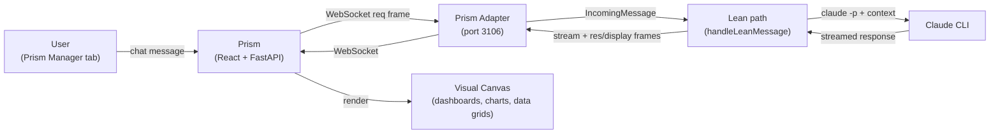

# Manager

[](LICENSE)

**Manager** is a lightweight portfolio oversight agent for the [Anthem](https://github.com/rauriemo/anthem) ecosystem. It runs as an Anthem instance in lean channel-only mode -- no issue tracker, no orchestrator session, no workspaces, no code editing. It reads source code and metadata across all sibling agent projects and answers questions via `claude -p`.

Think of it as the "portfolio analyst" for your Anthem agents. It has cross-project visibility that individual agents lack -- ask it about status, code quality, test coverage, or CI health across the entire ecosystem.

[Build plan](docs/plan.md) | [Anthem](https://github.com/rauriemo/anthem) (orchestrator) | [Prism](https://github.com/rauriemo/prism) (workstation) | [Forge](https://github.com/rauriemo/forge) (scaffolder) | [Dispatch](https://github.com/rauriemo/dispatch) (voice channel)

## Quick Start

```bash
# Manager is auto-cloned by Prism on first boot.
# To set up manually:

# 1. Clone
git clone https://github.com/rauriemo/Manager
cd Manager

# 2. Ensure Anthem is installed
go install github.com/rauriemo/anthem/cmd/anthem@latest

# 3. Ensure auth token exists
# ~/.anthem/channels.yaml should have a prism.token entry
# (Prism's setup CLI creates this automatically)

# 4. Run
anthem run
```

**You're done when:**
1. You see `prism adapter listening addr=:3106` in the log output
2. Prism connects and the Manager tab shows "online"
3. You can type a question in the Manager chat and get a response

## How It Works



1. User sends a chat message from Prism's Manager tab
2. Prism forwards it over WebSocket to Manager (port 3106)
3. Anthem's Prism adapter receives the message, routes to the lean message handler
4. The handler builds a prompt from the user's message + portfolio context (`CLAUDE.md`)
5. Invokes `claude -p` and streams stdout back as stream frames
6. On completion, sends the full response as a res frame for chat history
7. Any rich visual output (HTML dashboards, charts, data grids) is sent as display frames and rendered on Prism's visual canvas

## Features

- **Cross-project status reports**: Queries all sibling repos via `gh` CLI and local git for recent commits, open issues, CI status, and produces rich HTML summaries
- **Code review and analysis**: Reads source code from any sibling project directory for reviews, suggestions, or analysis
- **Portfolio health overview**: Aggregated metrics across all repos -- CI pass rates, issue counts, commit velocity
- **Rich visual output**: HTML dashboards, data grids, charts, and markdown rendered in Prism's A2UI visual pane
- **Lightweight and fast**: No orchestrator session, no executor pipeline. Each question is a single `claude -p` invocation
- **Read-only**: Never edits, writes, commits, or pushes to any project. Analysis only
- **Context-aware**: Reads `CLAUDE.md` from each project for architecture context before answering

## What Manager Does NOT Do

- Edit, write, or create files in any project
- Push, commit, or modify git state
- Route or proxy messages to other agents
- Run the full Anthem orchestrator/executor pipeline
- Manage workspaces or track GitHub issues

## Configuration

### WORKFLOW.md

Manager's `WORKFLOW.md` follows Anthem's format (YAML front matter + Go template body) but with minimal config:

```yaml
# Key settings (see WORKFLOW.md for full config)
orchestrator:
  enabled: false          # No orchestrator -- lean mode only

agent:
  permission_mode: "dontAsk"
  allowed_tools:          # Read-only tools
    - "Read"
    - "Grep"
    - "Glob"
    - "Bash(git *)"
    - "Bash(gh *)"
  denied_tools:           # No write access
    - "Edit"
    - "Write"
    - "Bash(rm *)"
    - "Bash(git push *)"

channels:
  - kind: prism
    target: "localhost:3106"
```

### Port and Voice Assignments

| Setting | Value |
|---------|-------|
| Prism channel port | `3106` (WebSocket) |
| Voice (primary) | `google/en-US-Chirp3-HD-Fenrir` |
| Voice (fallback) | `en-US-ChristopherNeural` |
| Auth token | Shared `PRISM_ANTHEM_TOKEN` |

## Context Gathering

Manager gathers information from two sources:

| Source | Method | Use For |
|--------|--------|---------|
| **Local directories** (primary) | `Read`, `Grep`, `Glob`, `git log/diff/status` | Source code, configs, commit history, branch status |
| **GitHub API** (fallback) | `gh issue list`, `gh pr list`, `gh run list` | Issue counts, PR data, CI status, contributor activity |

Local reads are preferred -- they're instant and work offline. GitHub API fills in data not available in the local git tree.

## Ecosystem

Manager is part of the Anthem ecosystem:

- **[Anthem](https://github.com/rauriemo/anthem)** -- Go orchestrator daemon. Polls GitHub issues, dispatches Claude Code workers, manages workspaces. Manager runs as a lean Anthem instance.
- **[Prism](https://github.com/rauriemo/prism)** -- Interactive visual workstation. Chat, A2UI canvas, TTS/STT. Manager's primary interface.
- **[Forge](https://github.com/rauriemo/forge)** -- Project scaffolding agent. Creates new Anthem projects with workflow configs.
- **[Dispatch](https://github.com/rauriemo/dispatch)** -- Voice-first command channel. Wake-word activation, ambient voice.

### Portfolio

| Project | Repo | Port | Role |
|---------|------|------|------|
| Prism | [rauriemo/prism](https://github.com/rauriemo/prism) | 3100/3101 | Visual workstation |
| Manager | [rauriemo/manager](https://github.com/rauriemo/Manager) | 3106 | Portfolio oversight (this project) |
| Forge | [rauriemo/forge](https://github.com/rauriemo/forge) | 3102 | Project scaffolding |
| Anthem | [rauriemo/anthem](https://github.com/rauriemo/anthem) | 3105 | Go orchestrator daemon |
| Dispatch | [rauriemo/dispatch](https://github.com/rauriemo/dispatch) | 3104 | Voice command channel |

## Project Structure

```
Manager/
  CLAUDE.md         # Portfolio context for Claude Code (architecture, ecosystem, display guidelines)
  WORKFLOW.md       # Anthem config (channel-only, read-only tools, Prism on port 3106)
  README.md         # This file
  .gitignore        # Excludes workspaces/, .env, *.db
  docs/
    plan.md         # Build plan and architecture decisions
```

Manager is intentionally minimal -- it's an Anthem instance whose power comes from its prompt, tool access, and the Claude CLI. There is no custom application code. `WORKFLOW.md` and `CLAUDE.md` are where the intelligence lives.

## Anthem Integration

Manager uses Anthem's lean channel-only mode, a lightweight path added specifically for agents that only need channel communication:

- **Lean message handler**: `handleLeanMessage` in Anthem's orchestrator invokes `claude -p` directly instead of the full orchestrator/executor pipeline
- **Optional tracker**: Manager runs with no `tracker` config -- Anthem skips the polling loop and only runs the channel listener
- **Streaming**: Real-time token streaming via Anthem's `stream` frame type
- **Display frames**: Rich visual content via Anthem's `display` frame type with A2UI components
- **`/status` fast path**: The lean handler also powers the `/status` slash command across all agents for fast, lightweight status checks

## License

[MIT](LICENSE)
