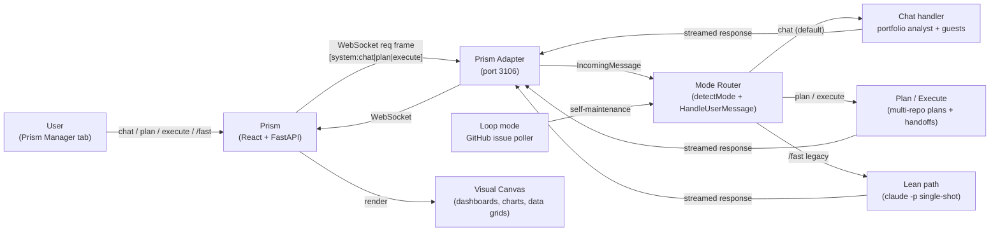

# Manager

[](LICENSE)

**Manager** is the portfolio oversight agent for the [Anthem](https://github.com/rauriemo/anthem) ecosystem. It runs as an Anthem project agent runtime with **Loop mode enabled** (tracker-backed self-maintenance via GitHub issues) and responds to portfolio-wide questions in Chat mode across all sibling projects.

Regular messages use Chat mode for conversational portfolio analysis. The optional `/fast` slash command takes the lean single-turn path for instant `claude -p` replies. Loop mode keeps Manager's own GitHub issues flowing through the standard orchestrator so it can maintain its own codebase. Think of it as one runtime wearing two hats: project maintainer (Loop) + portfolio analyst (Chat).

[Build plan](docs/plan.md) | [forge](https://github.com/rauriemo/forge) (scaffolder) | [prism](https://github.com/rauriemo/prism) (workstation) | [anthem](https://github.com/rauriemo/anthem) (orchestrator) | [dispatch](https://github.com/rauriemo/dispatch) (voice channel)

## Quick Start

```bash
# Manager is auto-cloned by Prism on first boot.
# To set up manually:

# 1. Clone
git clone https://github.com/rauriemo/Manager
cd Manager

# 2. Ensure Anthem is installed
go install github.com/rauriemo/anthem/cmd/anthem@latest

# 3. Ensure auth token exists
# ~/.anthem/channels.yaml should have a prism.token entry
# (Prism's setup CLI creates this automatically)

# 4. Run
anthem run
```

**You're done when:**
1. You see `prism adapter listening addr=:3106` in the log output
2. Prism connects and the Manager tab shows "online"
3. You can type a question in the Manager chat and get a response

## How It Works



**Chat (default)** — portfolio analyst. The orchestrator reads source code, git history, and GitHub data across all sibling repos and responds conversationally.

**Plan / Execute** — when a portfolio-wide change requires coordinated work across repos, Manager synthesizes an `ExecutionPlan` in Plan mode and hands it off to its own orchestrator (or guest agents) in Execute mode, with approval gates between multi-repo phases.

**Loop** — tracker-backed self-maintenance. GitHub issues labeled on `rauriemo/manager` are picked up by the `GitHubLoopBackend` just like any other Anthem project running with a tracker.

**`/fast` (legacy)** — a lean single-turn path that bypasses the orchestrator and shells `claude -p` directly. It now maps to Chat mode's lean branch (via the `fast` legacy tag remap).

## Features

- **All four Anthem modes**: Chat (default portfolio analyst), Plan (multi-repo change synthesis), Execute (approved handoff chains across sibling repos with approval gates), Loop (self-maintenance via GitHub issues). Plus the lean `/fast` branch for instant replies.
- **Self-maintaining**: Tracks its own GitHub issues under Loop mode and can edit its own codebase via the orchestrator
- **Cross-project analysis**: Chat and `/fast` queries read source code, git history, and GitHub data across all sibling repos (`additional_dirs` in WORKFLOW.md)
- **Rich visual output**: HTML dashboards, data grids, charts, and markdown rendered in Prism's A2UI visual pane; `execution.*` events render a live execution panel during multi-repo Execute runs
- **`/fast` for any agent**: The `/fast` slash command works on every agent tab in Prism, not just Manager
- **Context-aware**: Reads `CLAUDE.md` from each project for architecture context before answering

## Configuration

### WORKFLOW.md

Manager's `WORKFLOW.md` follows Anthem's format (YAML front matter + Go template body) with full orchestrator config:

```yaml
# Key settings (see WORKFLOW.md for full config)
tracker:
  kind: github
  repo: "rauriemo/manager"

orchestrator:
  enabled: true

agent:
  command: "claude"
  max_turns: 10
  permission_mode: "dontAsk"
  allowed_tools:
    - "Read"
    - "Edit"
    - "Write"
    - "Grep"
    - "Glob"
    - "Bash(git *)"
    - "Bash(gh *)"
  additional_dirs:
    - "../Forge"
    - "../prism"
    - "../anthem"
    - "../Dispatch"

channels:
  - kind: prism
    target: "localhost:3106"
```

### Port and Voice Assignments

| Setting | Value |
|---------|-------|
| Prism channel port | `3106` (WebSocket) |
| Voice (primary) | `google/en-US-Chirp3-HD-Fenrir` |
| Voice (fallback) | `en-US-ChristopherNeural` |
| Auth token | Shared `PRISM_ANTHEM_TOKEN` |

## Context Gathering

Manager gathers information from two sources:

| Source | Method | Use For |
|--------|--------|---------|
| **Local directories** (primary) | `Read`, `Grep`, `Glob`, `git log/diff/status` | Source code, configs, commit history, branch status |
| **GitHub API** (fallback) | `gh issue list`, `gh pr list`, `gh run list` | Issue counts, PR data, CI status, contributor activity |

Local reads are preferred -- they're instant and work offline. GitHub API fills in data not available in the local git tree.

## Ecosystem

Manager is part of the anthem ecosystem:

- **[forge](https://github.com/rauriemo/forge)** -- Project scaffolding agent. Creates new anthem projects with workflow configs.
- **[prism](https://github.com/rauriemo/prism)** -- Interactive visual workstation. Chat, A2UI canvas, TTS/STT. Manager's primary interface.
- **[anthem](https://github.com/rauriemo/anthem)** -- Go orchestrator daemon. Polls GitHub issues, dispatches Claude Code workers, manages workspaces. Manager runs as an anthem instance.
- **[dispatch](https://github.com/rauriemo/dispatch)** -- Voice-first command channel. Wake-word activation, ambient voice.

### Portfolio

| Project | Repo | Port | Role |
|---------|------|------|------|
| manager | [rauriemo/manager](https://github.com/rauriemo/manager) | 3106 | Portfolio oversight (this project) |
| forge | [rauriemo/forge](https://github.com/rauriemo/forge) | 3102 | Project scaffolding |
| prism | [rauriemo/prism](https://github.com/rauriemo/prism) | 3100/3101 | Visual workstation |
| anthem | [rauriemo/anthem](https://github.com/rauriemo/anthem) | 3105 | Go orchestrator daemon |
| dispatch | [rauriemo/dispatch](https://github.com/rauriemo/dispatch) | 3104 | Voice command channel |

## Project Structure

```
Manager/
  CLAUDE.md         # Portfolio context for Claude Code (architecture, ecosystem, display guidelines)
  WORKFLOW.md       # Anthem config (channel-only, read-only tools, Prism on port 3106)
  README.md         # This file
  .gitignore        # Excludes workspaces/, .env, *.db
  docs/
    plan.md         # Build plan and architecture decisions
```

Manager is intentionally minimal -- it's an Anthem instance whose power comes from its prompt, tool access, and the Claude CLI. There is no custom application code. `WORKFLOW.md` and `CLAUDE.md` are where the intelligence lives.

## Anthem Integration

Manager runs as a project agent runtime with all four Anthem modes plus the legacy lean fast path:

- **Chat / Plan / Execute**: Standard `HandleUserMessage` dispatch via the mode router (`[system:chat|plan|execute]`). Execute mode streams `execution.*` events for multi-repo handoff chains.
- **Loop mode**: `GitHubLoopBackend` is active because WORKFLOW.md declares a `tracker:` block. Issues labeled for `rauriemo/manager` flow through the normal Anthem pipeline for self-maintenance.
- **Lean `/fast` path**: `handleLeanMessage` in Anthem's orchestrator invokes `claude -p` directly for instant responses. `/fast` and `/status` slash commands route here (legacy `[system:fast]` tag remaps to Chat's lean branch).
- **Unified Prism tab**: Manager's built-in tab in Prism serves as both the portfolio dashboard and the agent chat interface.
- **Streaming**: Real-time token streaming via Anthem's `stream` frame type.
- **Display frames**: Rich visual content via Anthem's `display` frame type with A2UI components.

## License

[MIT](LICENSE)
