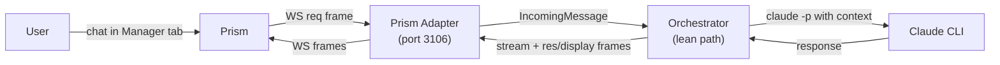

# Build Manager Anthem Agent

## Architecture Decision

Manager is a **full Anthem orchestrator agent** that also has a lean `/fast` path for instant portfolio queries. Regular messages go through the complete orchestrator pipeline (GitHub issue tracking, multi-turn Claude sessions, workspace management). `/fast` messages bypass the orchestrator and invoke `claude -p` directly via Anthem's `handleLeanMessage`.

This evolved from the original "lean channel-only" concept. The `/fast` slash command was added as a universal feature across all Prism agent tabs, giving every agent a lightweight conversational path alongside the full orchestrator.



## Part 1: Upstream Anthem Change (Small)

Currently, [`HandleUserMessage`](c:\Users\I9 Ultra\anthem\internal\orchestrator\orchestrator.go) at line 1159 checks `o.orchAgent == nil` and returns "Orchestrator agent is not enabled." We need a **lean fallback path** here that invokes `claude -p` directly instead.

**File:** `c:\Users\I9 Ultra\anthem\internal\orchestrator\orchestrator.go`

The change at line 1159-1161:
```go
// Current:
if o.orchAgent == nil {
    o.sendFollowUp(ctx, msg, "Orchestrator agent is not enabled.")
    return
}

// New: lean mode fallback -- invoke claude -p directly
if o.orchAgent == nil {
    o.handleLeanMessage(ctx, msg)
    return
}
```

New method `handleLeanMessage` on `Orchestrator`:
- Builds a prompt from the user's message text + any file attachments
- Prepends the project context (`CLAUDE.md` content) if available
- Invokes `claude -p "<prompt>"` via the existing `agent.Runner` interface (or a simple `exec.Command` for `-p` mode)
- Streams stdout deltas back as `StreamDelta` frames via the channel manager
- On completion, sends the full response as a `res` frame
- Parses any structured display output (JSON blocks with `kind` field) and sends as `display` frames

This is ~80-120 lines of new code in `orchestrator.go`. No new files needed.

**Also needed in Anthem:** Make the `tracker` config block optional. Currently Anthem expects a tracker to be configured. When `tracker.kind` is empty, the orchestrator should skip `ListActive` calls and the polling loop entirely, only running the channel listener.

**File:** `c:\Users\I9 Ultra\anthem\cmd\anthem\main.go` -- skip tracker/poller creation when `cfg.Tracker.Kind == ""`

## Part 1b: Lean /status for All Agents

Currently `/status` sends a `[system:status]` prompt through the full orchestrator pipeline (consult orchestrator agent session, parse contract actions, execute). This is heavyweight for a one-sentence status check.

**Change:** In `HandleUserMessage`, detect messages containing `[system:status]` and route them through `handleLeanMessage` (the same `claude -p` path) **even when the orchestrator agent is present**. This gives every agent a fast, lightweight `/status` response without spinning up the full contract/action machinery.

**File:** `c:\Users\I9 Ultra\anthem\internal\orchestrator\orchestrator.go`

The detection goes at the top of `HandleUserMessage`, after the ack but before `ListActive`:

```go
// Fast path for lightweight status queries
if strings.Contains(msg.Text, "[system:status]") {
    o.handleLeanMessage(ctx, msg)
    return
}
```

This means `handleLeanMessage` must work regardless of whether `orchAgent` is nil or not -- it's the universal fast path for simple prompts. The `CLAUDE.md` project context is still prepended so the agent has awareness of what it's working on.

## Part 2: Manager Project Files

All files go in `C:\Users\I9 Ultra\Manager\`.

### WORKFLOW.md

```yaml
---
# No tracker block -- lean/channel-only mode

polling:
  interval_ms: 0

workspace:
  root: "./workspaces"

channels:
  - kind: prism
    target: "localhost:3106"
    events: [task.completed, task.failed]

agent:
  command: "claude"
  max_turns: 1
  max_concurrent: 1
  stall_timeout_ms: 120000
  permission_mode: "dontAsk"
  allowed_tools:
    - "Read"
    - "Grep"
    - "Glob"
    - "Bash(git *)"
    - "Bash(gh *)"
    - "Bash(curl *)"
  denied_tools:
    - "Edit"
    - "Write"
    - "Bash(rm *)"
    - "Bash(git push *)"

orchestrator:
  enabled: false

system:
  constraints:
    - "Never edit or write files in any project -- read-only analysis only"
    - "Never push, commit, or modify git state in any repository"
    - "Always use rich visual output (HTML, charts, data grids) when answering from Prism"

server:
  port: 0
---
```

The template body (after `---`) will contain the portfolio-aware prompt: sibling project list with local paths, instructions to read `CLAUDE.md` from each project for context, instructions to use `gh` CLI for GitHub data, and guidance on producing structured display output for Prism.

### CLAUDE.md

Lightweight -- just portfolio context:
- List of sibling projects with local paths and GitHub repos
- What Manager is and is not (read-only analyst, not a code editor)
- How to gather context (local dirs first, `gh` fallback)
- How to produce rich visual output (display frame JSON format)
- Port assignments and voice config (locked in)

### .gitignore

```
workspaces/
.env
*.db
```

## Part 3: Prism Changes

### 3a. Add `ensure_manager()` to `setup.py`

**File:** [`c:\Users\I9 Ultra\prism\backend\setup.py`](c:\Users\I9 Ultra\prism\backend\setup.py)

Mirror the `ensure_forge()` pattern (lines 32-55):
- Add `MANAGER_REPO = "https://github.com/rauriemo/Manager.git"` constant
- Add `ensure_manager(base_path)` function that clones the repo if `Manager/` or `manager/` doesn't exist locally
- Call it from `run_setup()` after `ensure_forge()`
- Return `manager_dir` in the result dict

### 3b. Add `repo` field to agents.yaml

**File:** [`c:\Users\I9 Ultra\prism\backend\agents.yaml`](c:\Users\I9 Ultra\prism\backend\agents.yaml)

Add `repo: rauriemo/manager` to the `manager` entry (currently missing, unlike all other agents).

## Part 4: Push and Verify

1. Commit and push Manager files to `rauriemo/Manager`
2. Commit and push Prism changes (setup.py + agents.yaml)
3. Verify: run `anthem run` in the Manager directory, confirm Prism connects on port 3106
4. Verify: send a chat message from Prism's Manager tab, confirm a response comes back

## Scope Boundaries

**Completed:**
- Upstream Anthem lean mode (`handleLeanMessage` + optional tracker + validator updates)
- Lean `/status` for all agents (route `[system:status]` through `claude -p` even when orchestrator is enabled)
- Universal `/fast` slash command in Prism (route `[system:fast]` through lean path on any agent tab)
- Manager as full orchestrator agent with `WORKFLOW.md`, `CLAUDE.md`, `.gitignore`, `README.md`, CI
- Prism `setup.py` auto-clone + `agents.yaml` repo field
- Unified Manager tab in Prism (built-in dashboard + agent chat, no duplicate tabs)
- Welcome/dashboard pages updated with `/fast` command
- Full test coverage across Prism frontend, Prism backend, and Anthem

**Out of scope (future):**
- Skills and MCP tools for Manager
- Rich dashboard generation (Manager can produce HTML, but we won't build specialized dashboard templates yet)
- Agent lifecycle management (start/stop other agents via Prism REST API)
- Automated cross-project analysis (scheduled reports, etc.)
